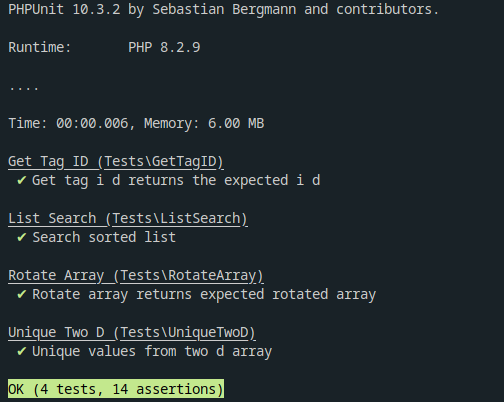

# _IZAM_ PHP Developer Test

## #1 Question Answer

> Q1- a query that lists all products (name and the current stock quantity) for each, the current stock is calculated by summing the negative and positive “Quantity” field in the “stock_transactions” table.

```sql
select
  product.name as name,
  SUM(stock_transactions.quantity) as current_stock
from
  product
  inner join stock_transactions on product.id = stock_transactions.product_id
GROUP BY
  product.id;

```

---

## #2 Question Answer

> Q2- a query that gets the total sold and total purchased quantities from each item.

```sql
select
  product.name as name,
  SUM(
    case when stock_transactions.type = "purchased" then stock_transactions.quantity end
  ) as total_purchased,
  SUM(
    case when stock_transactions.type = "sold" then stock_transactions.quantity end
  ) as total_sold
from
  product
  inner join stock_transactions on product.id = stock_transactions.product_id
GROUP BY
  product.id;

```

---

## #3 Question Answer

> Q3- The average sold price for each item.

```sql
select
  product.name as name,
  AVG(stock_transactions.price)
from
  product
  inner join stock_transactions on product.id = stock_transactions.product_id
Where
  stock_transactions.type = 'sold'
GROUP BY
  product.id;

```

---

## #4 Question Answer

> Q4- Write a function that takes a two-dimensional array and returns a one-dimensional array containing the unique values of each array (Without using the array_merge function on PHP).

```php
/**
 * This function accepts 2-d array and convert it to 1-d array with unique values.
 */
function getUniqueOf(array $twoD): array
{
    $uniqueValues = [];

    foreach ($twoD as $row) {
        foreach ($row as $item) {
            if (!in_array($item, $uniqueValues)) {
                $uniqueValues[] = $item;
            }
        }
    }

    return $uniqueValues;
}
```

---

## #5 Question Answer

> Q5- Write PHP code that searches in a sorted array, without calling any built-in functions.

```php

/**
 * use binary search algorithm to search in a sorted list for a needle or return false.
 * assuming the list is sorted ascending.
 *
 * @param mixed $needle
 *
 * @return mixed
 */
function searchSortedList(array $list, $needle)
{
    $start = 0;
    $end = count($list) - 1;
    while ($start <= $end) {
        $middleIndex = floor(($start + $end) / 2);
        if ($list[$middleIndex] === $needle) {
            return $middleIndex;
        }
        if ($list[$middleIndex] < $needle) {
            $start = $middleIndex + 1;
        } else {
            $end = $middleIndex - 1;
        }
    }

    return false;
}
```

---

## #6 Question Answer

> Q6- Write PHP function that takes an HTML tag as string and returns its ID value if existed or false if it has no ID

```php


/**
 * takes an HTML tag as string and returns its ID value if existed or false if it has no ID.
 *
 * @param [type] $htmlTag
 *
 * @return mixed
 */
function getTagID($htmlTag)
{
    $position = strpos($htmlTag, 'id="');

    if (empty($position)) {
        return false;
    }
    $afterID = substr($htmlTag, $position + 4);
    $position = strpos($afterID, '"');
    if (empty($position)) {
        return false;
    }

    return substr($afterID, 0, $position);
}
```

---

## #7 Question Answer

> Q7- Write a function that takes a two-dimensional array and rotates each ROW for 0,1,2 ..etc times, so it will shift the first row 0 times to the right, the second row will be shifted 1 time, the third will be shifted three times..

```php


/**
 * takes a two-dimensional array and rotates each ROW based on its index.
 */
function rotateArray(array $list): array
{
    foreach ($list as $index => $row) {
        for ($i = 0; $i < $index; ++$i) {
            array_unshift($row, array_pop($row));
        }

        $list[$index] = $row;
    }

    return $list;
}

```

---

## #8 Question Answer

> Q8- Swaps the second and third columns in the table.

```javascript
function swapColumns(tableId) {
  let table = document.getElementById(tableId);
  const columnIndex1 = 1;
  const columnIndex2 = 2;

  for (let i = 0; i < table.rows.length; i++) {
    let row = table.rows[i];
    let firstCell = row.cells[columnIndex1];
    let secondCell = row.cells[columnIndex2];
    let containerCell = firstCell.innerHTML;

    firstCell.innerHTML = secondCell.innerHTML;
    secondCell.innerHTML = containerCell;
  }
}
```

---

## #9 Question Answer

> Q9- Validate the form

```javascript
document
  .getElementById("MethodInp")
  .addEventListener("change", function (event) {
    let selectedValue = document.getElementById("MethodInp").value;
    if (selectedValue === "1") {
      document.getElementById("EmailDiv").style.display = "block";
      document.getElementById("PhoneDiv").style.display = "none";
    } else if (selectedValue === "2") {
      document.getElementById("EmailDiv").style.display = "none";
      document.getElementById("PhoneDiv").style.display = "block";
    } else {
      alert("kindly choose your method!");
    }
  });
document
  .getElementById("test_form")
  .addEventListener("submit", function (event) {
    event.preventDefault();
    const formData = new FormData(event.target);
    const formProps = Object.fromEntries(formData);
    console.log(formProps.method);
    if (formProps.method == 1) {
      if (formProps.email === "" || formProps.email === null) {
        alert("kindly enter your email address!");
        return;
      }
    } else if (formProps.method == 2) {
      if (formProps.phone === "" || formProps.phone === null) {
        alert("kindly enter your phone!");
        return;
      }
    } else {
      alert("kindly choose your method before submitting!");
      return;
    }
    document.getElementById("test_form").submit();
  });
```

---

##### You can view the repository on Github at https://github.com/ahmedmohamed24/izam-quiz to run the test cases.


